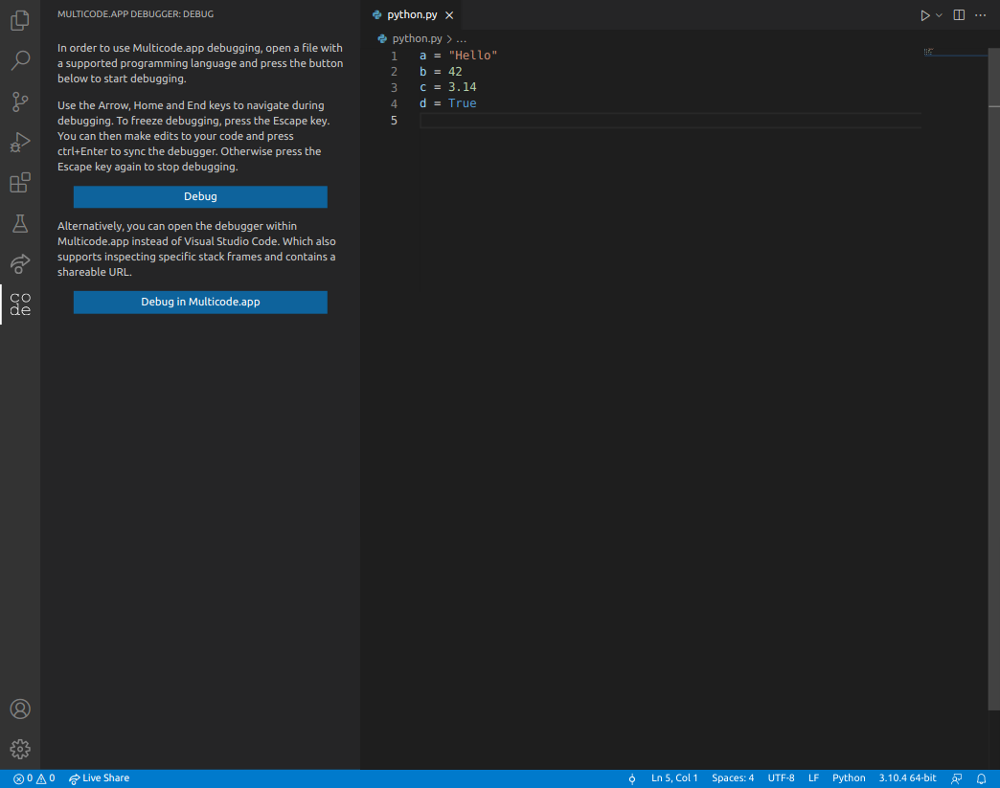

# Multicode.app Debugger

Debug your code using the [Multicode.app](https://multicode.app) Debugger.

This debugger allows you to debug anywhere, as long as you have an internet connection. No compilers or debuggers need to be installed.

## Usage

First, select a file that you'd like to debug. The programming language used in that file needs to be supported by Multicode. The currently supported programming languages include:
- Python
- C#
- JavaScript & TypeScript
- Bash

Open the Debugger view by clicking the [Multicode.app](https://multicode.app) logo.

Press the `Debug` button to start debugging within Visual Studio Code. Alternatively, you can start debugging within the Multicode.app website by pressing the `Debug in Multicode.app` button.

After pressing the `Debug` button, your code will be executed and after a short period the debug insights will become available.

On the left you'll see the `Insights` and `Stack Frames` of your code. The `Insights` contains all variables, functions and classes used within your code. The `Stack Frames` contain both the current and previous lines your code is executing.

You can navigate during your debugging session by pressing the Arrow, Home and End keys. To freeze debugging, press the Escape key. You can then make edits to your code and press ctrl+Enter to sync the debugger. Otherwise press the Escape key again to stop debugging.